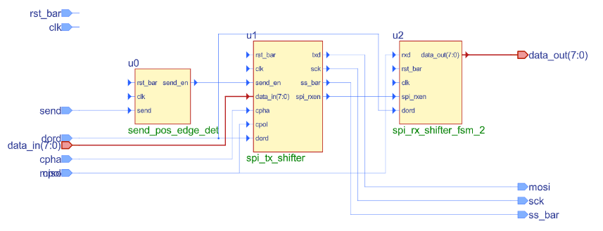

# spi_transmitter_reciever
A program that can convert parallel input data into serial output data.  
A synchronus system that is coded based on FINITE STATE MACHINE mathematical model.  
Operation is enabled upon detection of a positive edge at the enable pin.  
Configured with an asychronus reset.  
Includes separate testbench files used to verify proper operation.  
Meant to be programmed into PLDs using Synplify and Diamond by Lattice Semiconductor.   

BLOCK REPRESENTATION:   

